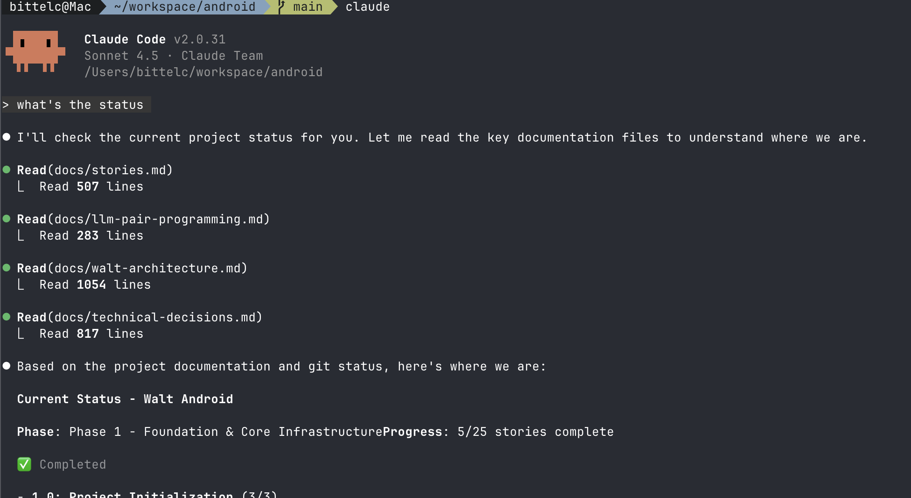

# Contextualizing Claude

I read a [beautiful blog post](https://worksonmymachine.ai/p/nobody-knows-how-to-build-with-ai) last week by Scott Werner about loading Claude Code up with the correct context on each session start. The blog post is sooo fun because it's one part "this is absurd, how does this work", and one part "it works like this". The main (technical, although there are many non-technical) takeaway from the article is that it can be super helpful to provide multiple layers of abstraction and intent to Claude by the following 4 files:

* CLAUDE.md – Provide basic info about the repo, but then instruct Claude to read all of the following before doing anything else.
* pair_programming.md – What patterns should the user and Claude follow in interactions? What level of detail and explanation?
* archicture.md – What are the sacred principles in the repo for building, that should never be forgotten?
* stories-planning.md – Where are we at with the project? Broken down into ticket-sized chunks, so context windows can efficiently grasp it.
* technical-considerations – A stockpile of documentation, lessons learned, RFC-type docs, SDK gotchas, etc.

I've taken Scott's excellent advice and applied it to Walt. Find the open source code here `[CLAUDE.md, /docs/*]`.

One notable variation is that I have applied git worktrees to the workflow. At both Walt and Legora, I am often working on multiple stories at the same time. My directory structure for this work is:

```
/android
  /.claude
    .CLAUDE.md #instructs about all markdown files, and git worktree pattern
    pair_programming.md
    archicture.md
    technical-considerations
  /android-main # directory for the `main` git worktree branch
  /android-story-abc # directory for the `abc` git worktree branch
    /.claude
      stories-planning.md # project planning for story "abc"
    [rest of repo]
  /android-story-123 # directory for the `123` git worktree branch
    /.claude
      stories-planning.md # project planning for story "123"
    [rest of repo]
```

At each session boot, Claude is immediately contextualized with the project and the current status.


